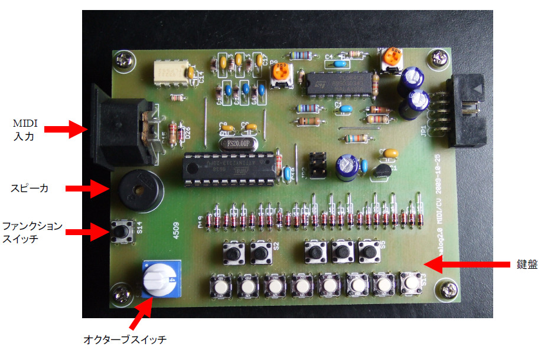

# Mini Board 2

## Mini Board 2 とは

 MInIBoard 2 は、Analog2.0 の簡易的なコントローラです。

以下のような機能を持っています。

- ライフラインケーブルに接続して、CV と Gate 信号を発生する。CV および Gate はライフラインのバスに出力する。
- CV と Gate は基板上の鍵盤または MIDI コネクタから入力した MIDI 信号により発生させます。
- 基板上の鍵盤を使ってオクターブスイッチで指定したオクターブ上の CV を発生させます。例えば、オクターブスイッチで	“4” を指定してAの鍵盤を押すと、A4 に相当する CV を発生します。
- ファンクションスイッチを1秒間押し続けると、スピーカから 440 Hz	の基準音が出力されます。基準音を止めるときにはファンクションスイッチをまた1秒間押し続けます。
- MIDI から CV と Gate 信号を発生させる時のふるまいは以下の通りです。
  - モノフォニック。同時に複数のノートONが入力された場合、高音が優先されます。
  - 複数のノートONが入力されたとき、二番目以降のONに対してリトリガーは行われません。
  - MIDI のピッチベンドメッセージを認識してCVを変化させます。

## 回路図

[doc/miniboard_schematic.pdf][doc/miniboard_schematic.pdf]

## ファームウェア

MiniBoard 2 を動かすには、AVR マイクロプロセッサ ATTiny2313 にファームウェアを書き込む必要があります。ファームウェアは、ビルド済みのものを http://gaje.jp/analog20 からダウンロードするか、ソースコードからビルドすることによって入手できます。

### ビルド方法

ビルドには、ソフトウェア Atmel Studio 7 が必要です。

http://www.atmel.com/microsite/atmel-studio/

ディレクトリ analog2.0\miniboard2\firmware の下の Atmel Studio ソリューションファイル firmware.atsln を開いて、プロジェクト "miniboard2 firmware" をビルドしてください。

